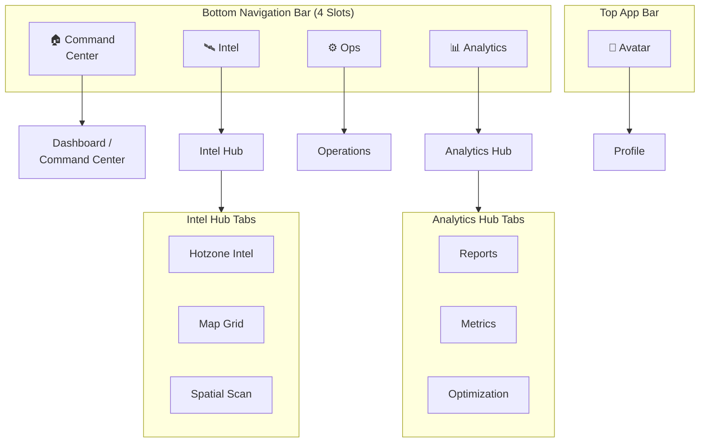

# Dynamic Design Draft — Ecopin App: Officer Role

| Field | Value |
|---|---|
| **Role** | Officer |
| **App** | Ecopin |
| **Total Pages** | 9 |
| **Overflow** | 9 pages → 4–5 nav slot limit |
| **Date** | 2026-10-03 |

---

## 1. Architectural Reasoning (The "Why")

### 1.1 Page Tiering

Pages are ranked by an Officer's predicted daily interaction frequency:

| Tier | Pages | Rationale |
|---|---|---|
| **Primary** (≈80% daily use) | Dashboard/Command Center, Hotzone Intel, Operations, Map Grid | The officer's core loop: check status → assess threats → deploy action → track location. These are touched dozens of times per shift. |
| **Secondary** (Periodic use) | Spatial Scan, Reports, Metrics | Deeper analytical tools. Used when investigating a specific zone, reviewing shift summaries, or checking KPIs — multiple times per day but not continuously. |
| **Tertiary** (Rare / Settings) | Optimization, Profile | Planning-phase tool and account settings. Used at shift start/end or on-demand, not during active operations. |

### 1.2 Affinity Grouping

Before selecting a pattern, pages are clustered by **functional domain**:

```
┌─────────────────────────────────────────────────────────┐
│  CLUSTER A: "Geospatial Intelligence"                   │
│  ├── Hotzone Intel   (threat awareness)                 │
│  ├── Map Grid        (spatial orientation)              │
│  └── Spatial Scan    (deep-dive analysis)               │
├─────────────────────────────────────────────────────────┤
│  CLUSTER B: "Performance & Planning"                    │
│  ├── Reports         (shift/incident reports)           │
│  ├── Metrics         (KPI tracking)                     │
│  └── Optimization    (route/resource planning)          │
├─────────────────────────────────────────────────────────┤
│  STANDALONE                                             │
│  ├── Dashboard/Command Center  (global overview)        │
│  ├── Operations                (active task management) │
│  └── Profile                   (account/settings)       │
└─────────────────────────────────────────────────────────┘
```

### 1.3 Selected Pattern: Hub & Spoke + App-Bar Extraction

> [!IMPORTANT]
> **Pattern**: Hub & Spoke with App-Bar Extraction
>
> Two natural clusters of 3 pages each become **hub screens** with internal top-tab sub-navigation. Profile is **extracted** from the bottom nav into a top app-bar avatar. This compresses 9 pages into **4 bottom-nav slots** — well within the 4–5 limit.

**Why this pattern fits the Officer role:**

| Criterion | Assessment |
|---|---|
| **Cognitive load** | Officers under pressure need predictable, muscle-memory navigation. A stable 4-slot bar beats a shifting contextual swap. |
| **Domain coherence** | The two clusters (Intel, Analytics) are tightly related internally — top tabs let the officer pivot between related views without losing context. |
| **No phantom actions** | FAB Extraction is wrong here: there is no single dominant creation action for an Officer. Their work is monitor → respond, not create → submit. |
| **Scalability** | If a 10th page is added later, it slots into an existing hub or the app bar — no nav redesign required. |

---

## 2. State-Based Layout Definitions (The "What")

### 2.1 Global Chrome (Always Visible)

```
╔══════════════════════════════════════════════════╗
║  TOP APP BAR                                     ║
║  ┌──────┐                          ┌──────────┐  ║
║  │ Logo │   [Page Title]           │ 🔔  (👤) │  ║
║  └──────┘                          └──────────┘  ║
║                                     ▲       ▲    ║
║                              Notifs   Avatar     ║
║                                     (Profile)    ║
╠══════════════════════════════════════════════════╣
║                                                  ║
║              [ PAGE CONTENT ]                    ║
║                                                  ║
╠══════════════════════════════════════════════════╣
║  BOTTOM NAV BAR (4 persistent slots)             ║
║  ┌──────────┬──────────┬──────────┬────────────┐ ║
║  │ Command  │  Intel   │   Ops    │ Analytics  │ ║
║  │ Center 🏠│   🛰️    │   ⚙️    │    📊      │ ║
║  └──────────┴──────────┴──────────┴────────────┘ ║
╚══════════════════════════════════════════════════╝
```

> [!NOTE]
> **Profile** is accessed via the avatar icon `(👤)` in the top-right of the app bar. Tapping it navigates to the full Profile page. This is a well-established pattern (Google Maps, Uber, Slack) that keeps tertiary pages out of the bottom nav.

### 2.2 Default State — Command Center Active

```
  Bottom Nav:  [ Command Center● ]  [ Intel ]  [ Ops ]  [ Analytics ]
  Page:        Dashboard/Command Center (full-screen content)
  Top Tabs:    None (standalone page)
```

### 2.3 Triggered State — Intel Hub Active

When the officer taps **Intel** in the bottom nav:

```
╔══════════════════════════════════════════════════╗
║  TOP APP BAR: "Intel"                    🔔 (👤) ║
╠══════════════════════════════════════════════════╣
║  TOP TAB BAR (3 tabs, horizontally scrollable)   ║
║  ┌──────────────┬──────────────┬───────────────┐ ║
║  │ Hotzone Intel│  Map Grid    │ Spatial Scan  │ ║
║  │      ●       │              │               │ ║
║  └──────────────┴──────────────┴───────────────┘ ║
║  ─── active tab indicator (underline) ───────    ║
╠══════════════════════════════════════════════════╣
║                                                  ║
║    [ Hotzone Intel Page Content ]                ║
║    (default landing tab for this hub)            ║
║                                                  ║
╠══════════════════════════════════════════════════╣
║  [ Command Center ]  [ Intel● ]  [ Ops ]  [ Analytics ]  ║
╚══════════════════════════════════════════════════╝
```

- **Default landing tab**: Hotzone Intel (highest priority in cluster)
- **Swipe gesture**: Horizontal swipe between the 3 tabs
- **Tab memory**: If the officer leaves Intel and returns, restore the last-active tab

### 2.4 Triggered State — Analytics Hub Active

When the officer taps **Analytics** in the bottom nav:

```
╔══════════════════════════════════════════════════╗
║  TOP APP BAR: "Analytics"                🔔 (👤) ║
╠══════════════════════════════════════════════════╣
║  TOP TAB BAR (3 tabs)                            ║
║  ┌──────────────┬──────────────┬───────────────┐ ║
║  │   Reports    │   Metrics    │ Optimization  │ ║
║  │      ●       │              │               │ ║
║  └──────────────┴──────────────┴───────────────┘ ║
╠══════════════════════════════════════════════════╣
║                                                  ║
║    [ Reports Page Content ]                      ║
║    (default landing tab for this hub)            ║
║                                                  ║
╠══════════════════════════════════════════════════╣
║  [ Command Center ]  [ Intel ]  [ Ops ]  [ Analytics● ]  ║
╚══════════════════════════════════════════════════╝
```

- **Default landing tab**: Reports (most frequently accessed in cluster)
- **Same behaviors**: Swipe between tabs, tab memory preserved

### 2.5 Triggered State — Operations Active

```
  Bottom Nav:  [ Command Center ]  [ Intel ]  [ Ops● ]  [ Analytics ]
  Page:        Operations (full-screen content, no top tabs)
  Top Tabs:    None (standalone page)
```

### 2.6 Triggered State — Profile (App-Bar Extraction)

```
  Trigger:     Tap avatar icon (👤) in top-right app bar
  Transition:  Push navigation (slide-in from right)
  Page:        Profile (full-screen)
  Bottom Nav:  Hidden (Profile is outside the main nav hierarchy)
  Back:        ← Back arrow in top-left returns to previous page
```

---

## 3. Execution Blueprint for the UI Agent (The "How")

### 3.1 Component Hierarchy

```
App (Root)
├── TopAppBar (persistent)
│   ├── AppLogo
│   ├── PageTitle (reactive to active route)
│   ├── NotificationBell [icon button]
│   └── AvatarButton [icon button] → navigates to /profile
│
├── MainScaffold
│   ├── PageContainer (switches based on active bottom-nav index)
│   │
│   │   ├── [Index 0] CommandCenterPage          ← standalone
│   │   │
│   │   ├── [Index 1] IntelHubPage               ← tabbed hub
│   │   │   └── TopTabBar
│   │   │       ├── [Tab 0] HotzoneIntelView     ← default
│   │   │       ├── [Tab 1] MapGridView
│   │   │       └── [Tab 2] SpatialScanView
│   │   │
│   │   ├── [Index 2] OperationsPage             ← standalone
│   │   │
│   │   └── [Index 3] AnalyticsHubPage           ← tabbed hub
│   │       └── TopTabBar
│   │           ├── [Tab 0] ReportsView           ← default
│   │           ├── [Tab 1] MetricsView
│   │           └── [Tab 2] OptimizationView
│   │
│   └── BottomNavigationBar (persistent, 4 items)
│       ├── NavItem: "Command Center"  icon: home        → Index 0
│       ├── NavItem: "Intel"           icon: satellite    → Index 1
│       ├── NavItem: "Ops"             icon: settings     → Index 2
│       └── NavItem: "Analytics"       icon: bar_chart    → Index 3
│
└── [Overlay Route] ProfilePage                   ← pushed, nav hidden
```

### 3.2 Gestures & Triggers

| # | Trigger | Action | Animation |
|---|---|---|---|
| G1 | `onTap` BottomNav item | Switch `PageContainer` to corresponding index. Update `PageTitle`. | Cross-fade (≈200ms ease-in-out) |
| G2 | `onTap` TopTab within Intel/Analytics hub | Switch visible tab view within hub. | Slide horizontal (≈250ms) |
| G3 | `onHorizontalSwipe` within Intel/Analytics hub | Advance/retreat to adjacent tab | Drag-follow + snap (physics-based) |
| G4 | `onTap` AvatarButton (top-right) | Push-navigate to `/profile` route. Hide BottomNav. | Slide-in from right (≈300ms) |
| G5 | `onTap` Back arrow on Profile page | Pop navigation stack. Restore BottomNav. | Slide-out to right (≈300ms) |
| G6 | `onReturn` to a hub (Intel or Analytics) | Restore last-active tab index from state | Instant (no animation) |

### 3.3 Routing Logic

```
/                                → Redirect to /command-center
/command-center                  → CommandCenterPage       [BottomNav Index 0]

/intel                           → Redirect to /intel/hotzone
/intel/hotzone                   → IntelHub > HotzoneIntelView  [BottomNav 1, Tab 0]
/intel/map-grid                  → IntelHub > MapGridView       [BottomNav 1, Tab 1]
/intel/spatial-scan              → IntelHub > SpatialScanView   [BottomNav 1, Tab 2]

/operations                      → OperationsPage          [BottomNav Index 2]

/analytics                       → Redirect to /analytics/reports
/analytics/reports               → AnalyticsHub > ReportsView      [BottomNav 3, Tab 0]
/analytics/metrics               → AnalyticsHub > MetricsView      [BottomNav 3, Tab 1]
/analytics/optimization          → AnalyticsHub > OptimizationView  [BottomNav 3, Tab 2]

/profile                         → ProfilePage             [No BottomNav, pushed overlay]
```

### 3.4 State Management Rules

```
NavigationState {
  activeBottomNavIndex: int          // 0–3, persisted across session
  intelHubLastTab: int               // 0–2, default 0
  analyticsHubLastTab: int           // 0–2, default 0
  previousRouteBeforeProfile: string // for back-navigation from Profile
}
```

> [!TIP]
> **Tab Memory Rule**: When the user navigates away from a hub (e.g., Intel → Ops) and returns, restore `intelHubLastTab` so they land on the tab they left. Reset only on app cold start.

### 3.5 Accessibility Contracts

| Element | Requirement |
|---|---|
| BottomNav items | `aria-label` with full name (e.g., "Command Center"), `aria-current="page"` on active |
| TopTab items | `role="tab"`, `aria-selected`, parent `role="tablist"` |
| AvatarButton | `aria-label="Open profile"` |
| Page transitions | Announce new page title to screen reader on route change |
| Swipe gestures (G3) | Must have equivalent tap target (the tab itself) — swipe is enhancement only |

---

## 4. Visual Summary



> **9 pages → 4 bottom-nav slots. Zero overflow. Zero "More" menus. Zero guesswork for the build agent.**
